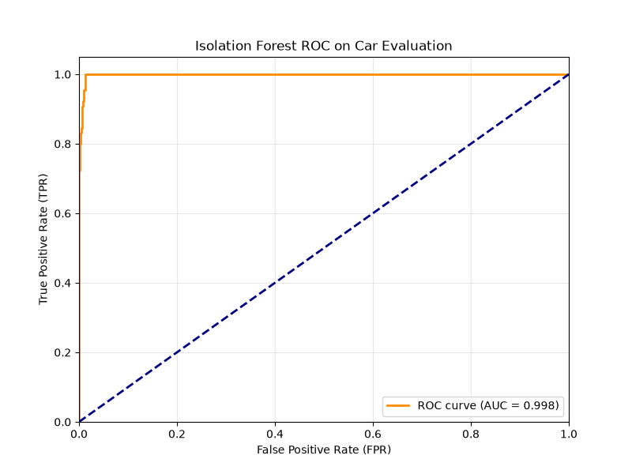

## ifcat-go

Go implementation of the Isolation Forest algorithm with support for Categorical data.

This is basically a golang implementation of the algorithm in [Extending Isolation Forest to support non-numerical data](https://github.com/SinaDBMS/IsolationForest) from Sina Barghidarian. Text features are are not supported for now.

## Experimental results

### Car Evaluation

- Source: https://archive.ics.uci.edu/dataset/19/car+evaluation
- Instances: 1275(class acc and class good are excluded)
  - class labels: unacc(normal), vgood(anomaly)
  - attributes: 0 Num, 6 Cat.

ROC curve:

